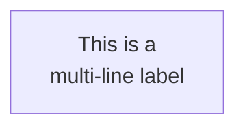
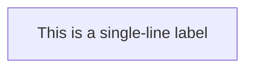
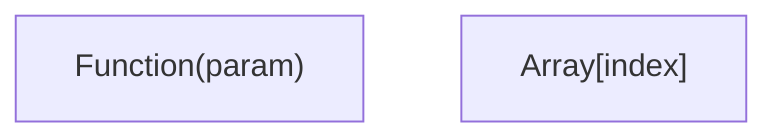
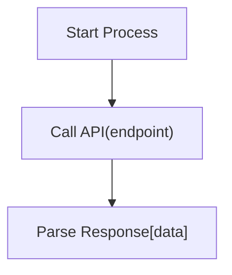

# Mermaid Label Format Rule

When generating Mermaid diagrams, follow these formatting rules for text labels to ensure proper rendering.

## Requirements

### No Line Breaks in Labels

Text labels in Mermaid nodes, edges, and other elements must not contain line breaks or newline characters.

**Incorrect:**


**Correct:**


### Quote Special Characters

When labels contain special characters such as parentheses, brackets, braces, or other symbols, wrap the entire label in double quotes.

**Special characters that require quoting:**
- Parentheses: `(` `)`
- Brackets: `[` `]`
- Braces: `{` `}`
- Angle brackets: `<` `>`
- Pipes: `|`
- Colons: `:`
- Semicolons: `;`
- Other special symbols

**Incorrect:**
```mermaid
graph TD
    A[Function(param)]
    B[Array[index]]
```

**Correct:**


## Examples



## Rationale

- Line breaks in labels can cause parsing errors in Mermaid
- Unquoted special characters may be interpreted as Mermaid syntax
- Proper quoting ensures consistent rendering across different Mermaid implementations
